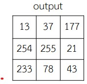
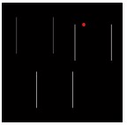
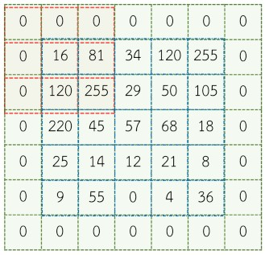

# Image
## Basic
nomaly we instead digital image with array 2 dimension 
```
+-----+-----+-----+-----+
| 0,0 | 0,1 | 0,2 | 0,3 |
+-----+-----+-----+-----+
| 1,0 | 1,1 | 1,2 | 1,3 |
+-----+-----+-----+-----+
| 2,0 | 2,1 | 2,2 | 2,3 |
+-----+-----+-----+-----+
| 3,0 | 3,1 | 3,2 | 3,3 |
+-----+-----+-----+-----+
```

## Image Types
- ### Binary Image
    every pixel will be show by binary 
    ```
    +---+---+---+---+
    | 1 | 0 | 0 | 0 |
    +---+---+---+---+
    | 1 | 1 | 1 | 0 |
    +---+---+---+---+
    | 1 | 1 | 1 | 0 |
    +---+---+---+---+
    | 1 | 0 | 0 | 0 |
    +---+---+---+---+
    ```
    
- ### Gray Scale Image
    like a binary image but its a 8 bit  
    ```
    +-----+-----+-----+-----+
    | 187 | 214 | 218 | 220 |
    +-----+-----+-----+-----+
    | 128 | 129 | 185 | 222 |
    +-----+-----+-----+-----+
    | 126 | 127 | 128 | 190 |
    +-----+-----+-----+-----+
    | 100 | 124 | 126 | 129 |
    +-----+-----+-----+-----+
    ```
    
- ### Color image 
    like a Gray Scale but have a 3 channel (r,g,b)
    ```
                R
    +-----+-----+-----+-----+
    | 187 | 214 | 218 | 220 |
    +-----+-----+-----+-----+
    | 128 | 129 | 185 | 222 |
    +-----+-----+-----+-----+  -----------+   
    | 126 | 127 | 128 | 190 |             |
    +-----+-----+-----+-----+             |
    | 100 | 124 | 126 | 129 |             |
    +-----+-----+-----+-----+             |
                                        |
                G                         |
    +-----+-----+-----+-----+             |
    | 137 | 244 | 208 | 120 |             |
    +-----+-----+-----+-----+             |
    | 108 | 129 | 185 | 122 |             |
    +-----+-----+-----+-----+  -----------+----> combine
    | 122 | 137 |  18 |  90 |             |               
    +-----+-----+-----+-----+             |
    | 102 | 124 |  12 | 29  |             |
    +-----+-----+-----+-----+             |
                                        |
                B                         |
    +-----+-----+-----+-----+             |
    | 18  | 234 | 28  | 221 |             |
    +-----+-----+-----+-----+             |
    | 18  | 169 |  18 | 242 |             |
    +-----+-----+-----+-----+  -----------+
    | 12  | 127 |  18 | 120 |
    +-----+-----+-----+-----+
    | 100 | 124 | 126 | 129 |
    +-----+-----+-----+-----+

    ```

- ### Index Image 
    every pixel be contain index number which will be taken to compare with Color Table
    ```
    +---+---+---+---+
    | 3 | 4 | 5 | 1 |
    +---+---+---+---+
    | 2 | 3 | 5 | 1 |
    +---+---+---+---+
    | 2 | 3 | 2 | 1 |
    +---+---+---+---+
    | 3 | 4 | 3 | 1 |
    +---+---+---+---+
    ```

    ------------Color Table------------- 
    | Index | Red | Grenn | Blue |
    | ----- | --- | ----- | ---- |
    | 1     | 2   | 20    | 254  |
    | 2     | 234 | 34    | 12   |
    | 3     | 249 | 80    | 6    |
    | 4     | 254 | 5     | 16   |
    | 5     | 250 | 23    | 128  |

    


## Image File sizes
The size of the image file depends on Size and The number of bits used to represent the value.

### example
In case black and white image with 1 pixel represent by 1 bit

$$ 512*512*1 = 262,144bit = 32,768Byte = 0.033MB $$
In case gray scale with 1 pixel represent by 8 bit
$$ 512 * 512 * 8  = 2,097,152 bit = 262,144 Byte = 0.262 MB $$
In case color image with 1 pixel represent by 8 bit and have red channel green channel and blue channel
$$ 512 * 512 * 8 * 3 =6,291,456 bit = 786,432 Byte = 0.786 MB $$

## Image Brightness
average values of gray in every pixel of image 
```math
B = brightness ={ \frac{1}{NM} \sum_{y=0}^{M-1} \sum_{y=0}^{N-1}I(x,y)} 
```
## Image Contrast
The difference between the brightness and darkness of the image.
```math
C = contrast = \sqrt{\frac{1}{NM} \sum_{y=0}^{M-1} \sum_{y=0}^{N-1} (I(x,y)-B)^2} 
```

# Convert RGB to Grayscale
```math
I_{Grayscale}=0.229R + 0.587G + 0.114B 
```

##### Do it in every pixel!!


# Convert Grayscale to Binary
$$ I_{BW}={ \lbrace_{255;I_{grayscale} > Th}^{0;I_{grayscale}\leq Th}} $$


# Image Histogram
Image Histogram is a graph that shows the number of pixel of image according grayscale
```
number of pixel
|
|
|
|
|           |
|       |   |    
|       |   |   |       |
|   |   |   |   |   |   |
|   |   |   |   |   |   |   |    
|------------------------------grayscale (0-255,etc)
```
- ## Histogram Equalization
    Histogram Equalization is one way to improve image quality.
    ##### Example
    ```
    +---+---+---+---+                 number of pixel
    | 2 | 3 | 3 | 2 |                 |
    +---+---+---+---+               6 |    |
    | 4 | 2 | 4 | 3 |               5 |    |  |  
    +---+---+---+---+    ------>    4 |    |  |  |
    | 3 | 2 | 3 | 5 |               3 |    |  |  |
    +---+---+---+---+               2 |    |  |  |
    | 2 | 4 | 2 | 4 |               1 |    |  |  |  |    
    +---+---+---+---+                 |-+--+--+--+--+--+--+--+--+-- Grayscale
                                        1  2  3  4  5  6  7  8  9
    ```
    Original image have a 4*4 pixel and Gr  ayscale 0-9
    | Gray level                            | 0              | 1              | 2              | 3               | 4               | 5               | 6               | 7               | 8               | 9               |
    | ------------------------------------- | -------------- | -------------- | -------------- | --------------- | --------------- | --------------- | --------------- | --------------- | --------------- | --------------- |
    | number of pixel                       | 0              | 0              | 6              | 5               | 4               | 1               | 0               | 0               | 0               | 0               |
    | cumulative plus                       | 0              | 0              | 6              | 11              | 15              | 16              | 16              | 16              | 16              | 16              |
    | divide by number of pixel             | $\frac{0}{16}$ | $\frac{0}{16}$ | $\frac{6}{16}$ | $\frac{11}{16}$ | $\frac{15}{16}$ | $\frac{16}{16}$ | $\frac{16}{16}$ | $\frac{16}{16}$ | $\frac{16}{16}$ | $\frac{16}{16}$ |
    | mutiple by maximun of Grayscale (ans) | 0              | 0              | 3.3            | 6.1             | 6.4             | 9               | 9               | 9               | 9               | 9               |

    map the value with original
    ``` 
    +---+---+---+---+                 number of pixel
    | 3 | 6 | 6 | 3 |                 |
    +---+---+---+---+               6 |       |      
    | 8 | 3 | 8 | 6 |               5 |       |        |     
    +---+---+---+---+    ------>    4 |       |        |     |
    | 6 | 3 | 6 | 9 |               3 |       |        |     |
    +---+---+---+---+               2 |       |        |     |
    | 3 | 8 | 3 | 8 |               1 |       |        |     |  |    
    +---+---+---+---+                 |-+--+--+--+--+--+--+--+--+-- Grayscale
                                        1  2  3  4  5  6  7  8  9
    ```
# Piecewise Linear transformation functions
- ### Contrast stretching -> normallization
    Original range[84 - 153]to[0 - 255]
    ```math
     I_{new} = (I - Min)\frac{NewMax-NewMin}{Max*Min}+NewMin 
    ```
    #### Example
    
 - ### Contrast starching
    Find the equation of a straight line
    ```math
     y - y_{1} = \frac{y_{1}-y_{2}}{x_{1}-x_{2}}(x-x_{1})
    straight line A -> y - 0 = \frac{0-51}{0-102}(x-0)
    straight line B -> y - 51 = \frac{51-204}{102-153}(x-102)
    straight line C -> y - 204 = \frac{204-255}{153-255}(x-153)
    ```
    
     straight line A -> $ y=0.5x $
     straight line B -> $ y=3x-255 $
     straight line C -> $ y=0.5x+127.5 $
    instead pixel value in equation
    #### Example 
    26 is in straight line A => $ y = 0.5 -> y=0.5(26) = 23 $
    144 is in straight line B => $ y = 3x-255-> y=3(144)-255 = 177 $
    254 is in straight line C => $ y = 0.5x+127.5 -> y=0.5(254)-127.5 = 255 $
    
    


# Image Filtering
It is an important processing for disposal. unwanted frequency components
out of the picture
- disposal high frequency => High pass filter (HPF)
- disposal low frequency => Low pass filter (LPF)

- ## Median Filtering
  Can be used to eliminate salt and pepper noise.
  #### Example
    
    sort value in red windows and then use position 5 of sort table to map in new table 
    if not have value in space on windows ,you have to just instead by 0
    
- ## Average Filter
    just average every value in spac on red window and then map to naw table
    if not have value in space on windows ,you have to just instead by 0
    #### Example
    $$ Pixel_{out}=\frac{0+0+0+0+16+8+0+120+25}{9} $$
    

# Edge detection
- ## Derivative No. 1 (Gradient)
    Finding the Running Difference of Pixels Along a Rowand column orientation of the image.
    Row and column gradients can be calculated using 2D convolution.
    $ G(x,y)= G_{R}(x,y)+G-{C}(x,y) $
    
    $ G_{R}(x,y) = |I(x,y)-I(x,y+1)| $ --> $ G_{R}(x,y)=|I(x,y)*H_{R}(x,y)| $
    
    $ G_{C}(x,y) = |I(x,y)-I(x-1,y)| $ --> $ G_{C}(x,y)=|I(x,y)*H_{C}(x,y)|$
    
    #### Example
    on this example used Pixel Difference for mapping to new table
    if not have value in space on windows ,you have to just instead by 0
    $$G_{R}(1,1)=|(0*0)+(0*-1)+(0*0)+(0*0)+(16*1)+(81*0)+(0*0)+(120*0)+(255*0)| = 16$$
    
    $$G_{C}(1,1)=|(0*0)+(0*0)+(0*0)+(0*0)+(16*1)+(81*-1)+(0*0)+(120*0)+(255*0)| = 65$$
    
    and then combine two tables 
    $$ G(x,y)=G_{R}(x,y)+G_{C}(x,y) $$
    
- ## Derivative No. 2  (Laplacian)
    like a Derivative No. 1 but combine Row equation and column equation
    $G(x,y)=I(x+1,y)+I(x-1,y)+I(x,y-1)+I(x,y+1)-4I(x,y)$
    
    #### Example
    Do everthing like Gradient 
    $$G(1,1)=|(0*0)+(0*1)+(0*0)+(0*1)+(16*-4)+(81*1)+(0*0)+(120*1)+(255*0)| = 137$$
    
    